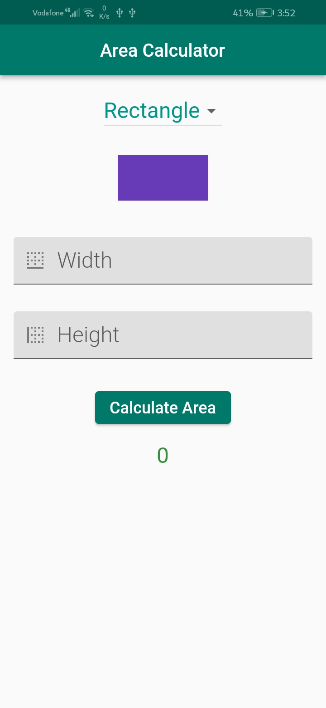
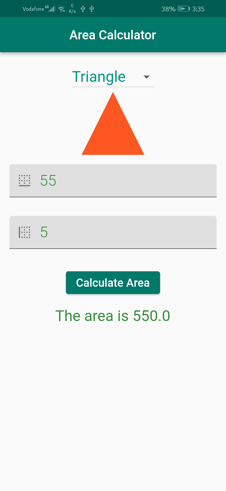
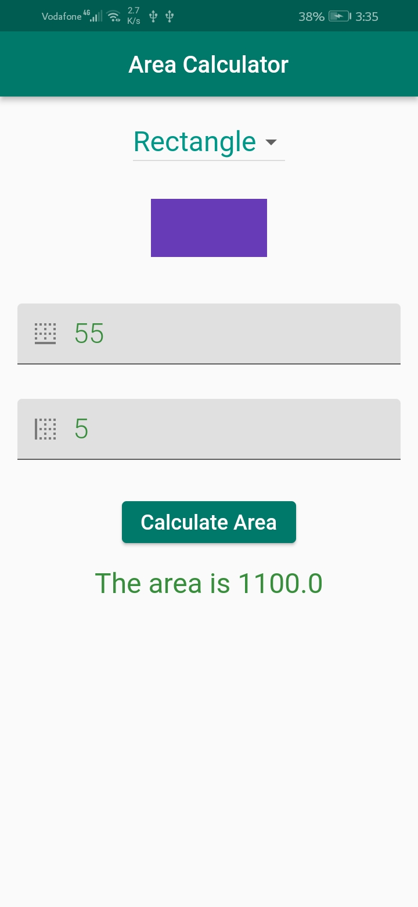

# Area Calculator Application

A new Flutter project. it consists of Area Calculator Screen.

### Covered:
# Container
    - Size
    - Position
  * BoxConstraints
  * BoxDecoration
  * Color
  * Gradients
    - LinearGradient
    - RadialGradient
  * DecorationImage
      - BoxFit

# Drawing Custom Shapes
  * Canvas
  * Paint
  * Path, Rect

### Main purposes of this project:
* How to employ the container to achieve what I want.

#### Project Pages:
- Area Calculator Screen

## ScreenShots

  
   
   

